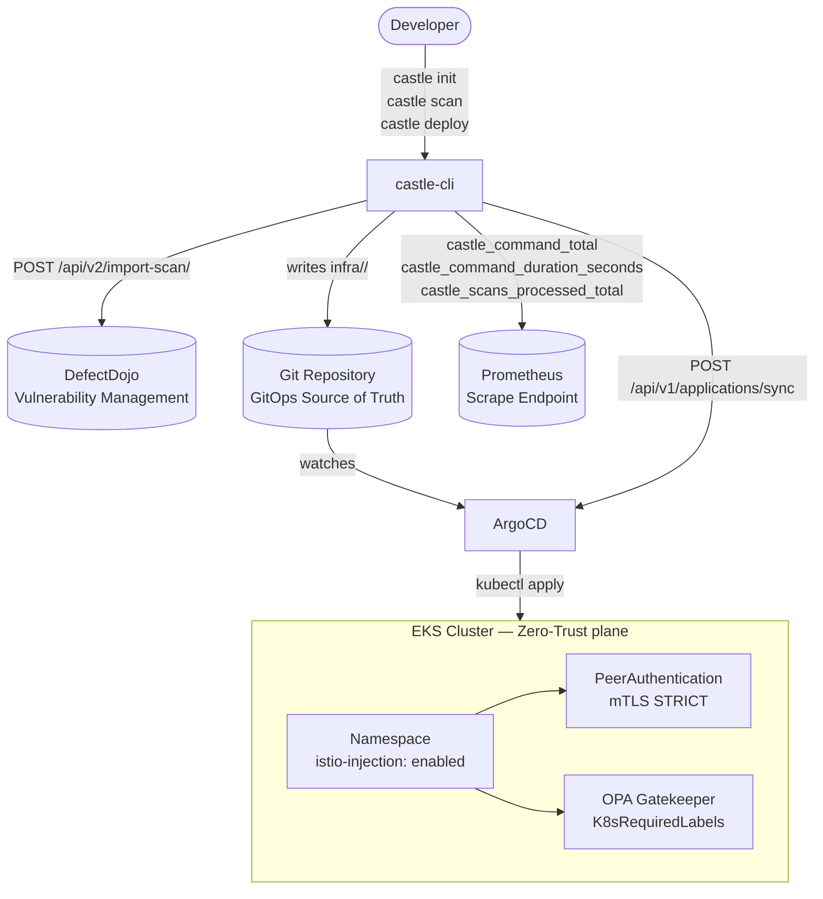

# castle-cli

> **Internal Developer Platform CLI** — self-service security, Zero-Trust infrastructure and GitOps workflows in a single binary.

[](https://go.dev/doc/go1.22)
[](LICENSE)
[](https://istio.io/latest/docs/concepts/security/)
[](https://argo-cd.readthedocs.io)
[](https://prometheus.io)

`castle-cli` is a developer-facing CLI that abstracts the three most critical platform concerns for microservice teams: **shift-left security** (Trivy / Semgrep → DefectDojo), **Zero-Trust infrastructure** (Istio mTLS STRICT + OPA Gatekeeper), and **GitOps deployments** (ArgoCD Application manifests + sync API). Native Prometheus telemetry is emitted on every command without any external agent.

---

## Architecture



---

## Core features

### `castle init` — Zero-Trust scaffold
Generates three opinionated, production-ready Kubernetes manifests under `./infra/<app>/` in a single command:

- **`namespace.yaml`** — Namespace with `istio-injection: enabled` and `team` label.
- **`peer-authentication.yaml`** — Istio `PeerAuthentication` enforcing `mode: STRICT` across the namespace; no plaintext traffic allowed.
- **`gatekeeper.yaml`** — OPA Gatekeeper `ConstraintTemplate` (`K8sRequiredLabels`) that blocks any `Deployment` or `Pod` missing a `team` label, preventing unowned workloads from running.

All names are validated against RFC 1123 before rendering. Output is idempotent.

### `castle scan` — Shift-Left Security
Runs Trivy (filesystem scan) or Semgrep (SAST) against any target and optionally uploads findings to DefectDojo via its import-scan REST API. Falls back to a structured stub report when the scanner binary is not in `$PATH`, keeping CI pipelines green during bootstrap.

### `castle deploy` — GitOps Delivery
Renders a fully-configured ArgoCD `Application` manifest (API version `argoproj.io/v1alpha1`) with automated sync, prune and self-heal enabled. The application name follows the `<app>-<env>` convention. With `--sync`, triggers an immediate reconciliation via the ArgoCD REST API without requiring `kubectl` or the `argocd` CLI.

Default revision policy: `staging` → `main`; `prod` / `production` → `HEAD`.

### Native SRE Telemetry
Every command automatically records three Prometheus metrics on an isolated registry (no global state, safe for testing):

| Metric | Type | Labels |
|---|---|---|
| `castle_command_total` | CounterVec | `command`, `status` |
| `castle_command_duration_seconds` | HistogramVec | `command` |
| `castle_scans_processed_total` | CounterVec | `severity` |

Metrics are recorded on both the success and error paths. The registry is accessible via `telemetry.Metrics.Registry()` for wiring to a `promhttp` handler.

---

## Quickstart

### Prerequisites

- Go 1.22+
- `make`
- (Optional) Trivy or Semgrep in `$PATH` for real scan results
- Access to DefectDojo, ArgoCD, and an EKS cluster for full integration

### Build

```bash
git clone https://github.com/manuel-garcia-gomez/castle-cli.git
cd castle-cli
make build          # produces ./bin/castle
```

The `Makefile` equivalent:

```bash
go build -o bin/castle ./...
```

### Configure

```bash
cp castle.example.yaml castle.yaml
# Edit castle.yaml — or export environment variables:
export CASTLE_DEFECTDOJO_API_KEY="your-dd-token"
export CASTLE_ARGOCD_TOKEN="your-argocd-token"
```

### Run

```bash
# Scaffold Zero-Trust manifests for a new microservice
./bin/castle init --app payments --team platform

# Run a Trivy scan against the current directory
./bin/castle scan --type trivy --target .

# Scan and upload findings to DefectDojo engagement 42
./bin/castle scan --type semgrep --target ./src --upload --engagement-id 42

# Generate ArgoCD Application manifest for staging
./bin/castle deploy --app payments --env staging --repo https://github.com/org/gitops.git

# Generate manifest AND trigger immediate ArgoCD sync in production
./bin/castle deploy --app payments --env prod --repo https://github.com/org/gitops.git --sync
```

### Interactive Demo

`scripts/demo.sh` walks through the full `init → scan → deploy` flow in a single script — no backend infrastructure required (no ArgoCD, DefectDojo, or Kubernetes cluster). Each step runs inside an isolated `mktemp` directory under `/tmp` that is automatically deleted on exit, so nothing is written to your repository.

> If `./bin/castle` does not exist yet, the script calls `make build` automatically before starting.

```bash
chmod +x scripts/demo.sh
./scripts/demo.sh
```

The script pauses between steps so you can inspect each output at your own pace. It detects whether Trivy is available in `$PATH` and explains the stub-fallback mode if it is not, making it safe to run on any machine.

---

## Command reference

### Global flags

| Flag | Default | Description |
|---|---|---|
| `--config` | (auto-detect) | Path to `castle.yaml`. Falls back to `$HOME/.castle.yaml` then `./castle.yaml`. |

---

### `castle init`

Scaffold Zero-Trust Kubernetes manifests for a microservice.

```
castle init --app <name> --team <name>
```

| Flag | Required | Default | Description |
|---|---|---|---|
| `--app` | ✅ | — | Microservice name. Used as the Kubernetes namespace. Must be a valid RFC 1123 label (`^[a-z0-9]([a-z0-9\-]*[a-z0-9])?$`). |
| `--team` | ✅ | — | Owning team name. Written into namespace and Gatekeeper labels. |

**Output** — `./infra/<app>/`:

```
infra/payments/
├── namespace.yaml
├── peer-authentication.yaml
└── gatekeeper.yaml
```

**Example:**

```bash
castle init --app payments --team platform
#   created infra/payments/namespace.yaml
#   created infra/payments/peer-authentication.yaml
#   created infra/payments/gatekeeper.yaml
```

---

### `castle scan`

Run a security scanner and optionally push results to DefectDojo.

```
castle scan [--type trivy|semgrep] [--target <path>] [--upload] [--engagement-id <id>]
```

| Flag | Required | Default | Description |
|---|---|---|---|
| `--type` | — | `trivy` | Scanner engine: `trivy` (SCA / container) or `semgrep` (SAST). |
| `--target` | — | `.` | Path or container image reference to scan. |
| `--upload` | — | `false` | Upload the report to DefectDojo after scanning. Requires `defectdojo.api_key`. |
| `--engagement-id` | — | `1` | DefectDojo engagement ID to import findings into. Used only when `--upload` is set. |

**Examples:**

```bash
# Local filesystem scan (Trivy)
castle scan --type trivy --target .

# SAST scan of a specific directory
castle scan --type semgrep --target ./services/payments

# Scan + upload to DefectDojo
castle scan --type trivy --upload --engagement-id 7
```

---

### `castle deploy`

Generate an ArgoCD Application manifest and optionally trigger a sync.

```
castle deploy --app <name> --env <env> --repo <url> [--sync] [--revision <ref>]
```

| Flag | Required | Default | Description |
|---|---|---|---|
| `--app` | ✅ | — | Microservice name. Also used as the target Kubernetes namespace. |
| `--env` | ✅ | — | Target environment (`staging`, `prod`, `production`, …). Determines default revision. |
| `--repo` | ✅ | — | Git repository URL that ArgoCD will track. |
| `--sync` | — | `false` | Trigger an immediate ArgoCD sync after writing the manifest. Requires `argocd.url` and `argocd.token`. |
| `--revision` | — | `main` / `HEAD` | Git ref to deploy. Defaults to `main` (non-prod) or `HEAD` (prod). |

**ArgoCD Application naming:** `<app>-<env>` (e.g. `payments-staging`).

**Git path convention:** `infra/<app>` — matches the layout produced by `castle init`.

**Examples:**

```bash
# Generate manifest for staging (commits to GitOps repo triggers ArgoCD)
castle deploy --app payments --env staging --repo https://github.com/org/gitops.git

# Generate manifest for production with explicit tag
castle deploy --app payments --env prod --repo https://github.com/org/gitops.git --revision v1.4.2

# Generate + immediately sync via ArgoCD API
castle deploy --app payments --env prod \
  --repo https://github.com/org/gitops.git \
  --sync
```

---

## Configuration matrix

`castle` loads configuration from `castle.yaml` (project root or `$HOME`) and merges environment variables with the `CASTLE_` prefix. Environment variables always take precedence.

| YAML key | Environment variable | Default | Description |
|---|---|---|---|
| `environment` | `CASTLE_ENVIRONMENT` | `development` | Runtime environment tag (`development`, `staging`, `production`). |
| `port` | `CASTLE_PORT` | `8080` | Local API server port (reserved for future `castle serve`). |
| `defectdojo.url` | `CASTLE_DEFECTDOJO_URL` | `https://defectdojo.example.com` | Base URL of the DefectDojo instance. No trailing slash. |
| `defectdojo.api_key` | `CASTLE_DEFECTDOJO_API_KEY` | `""` | DefectDojo API v2 key. **Never commit to VCS.** |
| `kubernetes.namespace` | `CASTLE_KUBERNETES_NAMESPACE` | `default` | Default target namespace. |
| `kubernetes.kubeconfig` | `CASTLE_KUBERNETES_KUBECONFIG` | `""` | Path to kubeconfig. Empty = in-cluster or `$HOME/.kube/config`. |
| `argocd.url` | `CASTLE_ARGOCD_URL` | `https://argocd.example.com` | ArgoCD API server base URL. No trailing slash. |
| `argocd.token` | `CASTLE_ARGOCD_TOKEN` | `""` | ArgoCD API token. **Never commit to VCS.** |

Full annotated example: [`castle.example.yaml`](castle.example.yaml).

---

## Development & testing

### Project layout

```
castle-cli/
├── cmd/                     # CLI entry-points (thin — flag parsing only)
│   ├── root.go              # cobra root + config hook + telemetry hooks
│   ├── scan.go              # castle scan
│   ├── init.go              # castle init
│   └── deploy.go            # castle deploy
├── internal/
│   ├── config/              # viper-backed configuration loader
│   ├── security/            # DefectDojo client + Trivy/Semgrep scanner
│   ├── k8s/                 # Zero-Trust manifest generator (text/template)
│   ├── gitops/              # ArgoCD manifest generator + sync client
│   └── telemetry/           # Prometheus metrics (isolated registry)
├── castle.example.yaml      # Annotated configuration reference
├── go.mod
└── Makefile
```

### Make targets

```bash
make build      # Compile to ./bin/castle
make test       # go test ./... -race -count=1
make lint       # golangci-lint run ./...
make coverage   # go test ./... -coverprofile=coverage.out && go tool cover -html=coverage.out
make vet        # go vet ./...
```

### Run the test suite

```bash
# All packages
go test ./... -race -count=1 -v

# Telemetry package only
go test ./internal/telemetry/... -race -v

# With coverage report
go test ./... -coverprofile=coverage.out
go tool cover -func=coverage.out
```

### Code conventions

- **No `panic()`** — all error paths return `error`.
- **Error wrapping** — every returned error includes context: `fmt.Errorf("context: %w", err)`.
- **Structured logging** — `log/slog` with JSON output; no `fmt.Println` in business logic.
- **Thin commands** — `cmd/` files contain only flag declarations and `RunE` wiring. All logic lives in `internal/`.
- **HTTP clients** — explicit 30-second timeouts on all `net/http` clients.
- **Tests** — `github.com/stretchr/testify` alongside each `internal/` package; `httptest.NewServer` for HTTP integrations.

---

## Design decisions

**Isolated Prometheus registry per `Metrics` instance.** Using `prometheus.NewRegistry()` instead of the default global registry prevents duplicate-registration panics in tests and allows the `telemetry` package to be unit-tested in parallel without shared state.

**Scanner stub fallback.** When `trivy` or `semgrep` is not found via `exec.LookPath`, the scanner writes a structured stub JSON report instead of erroring out. This keeps CI green during platform bootstrap and enables testing the upload path without scanner binaries.

**ArgoCD Application name convention (`<app>-<env>`).** This compound name is unique per microservice per environment in the same ArgoCD instance, avoids name collisions across teams, and aligns with ArgoCD's recommended multi-environment project layout.

**`PersistentPostRunE` for telemetry.** cobra invokes `PostRunE` only on successful completion; errors are captured in `Execute()` via `rootCmd.Execute()`'s returned error, ensuring both success and error paths emit a metric without requiring each command to call `RecordCommand` manually.

---

## License

MIT © Manuel García
